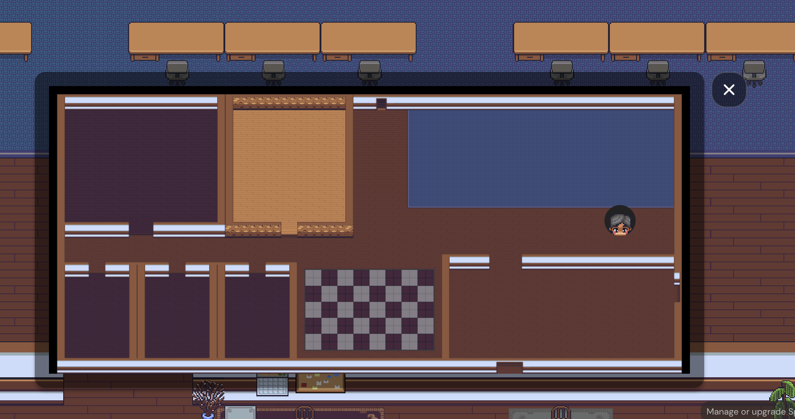
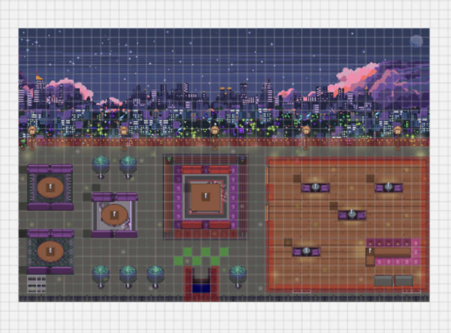
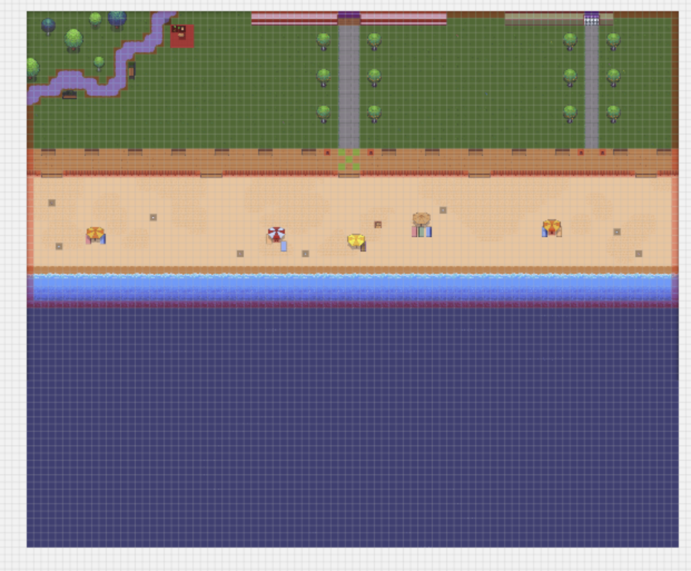
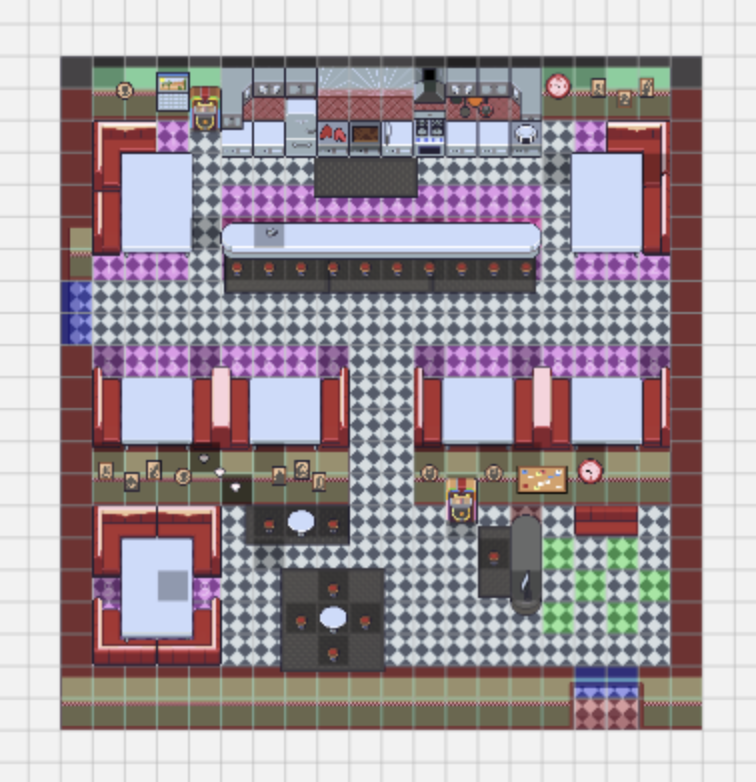
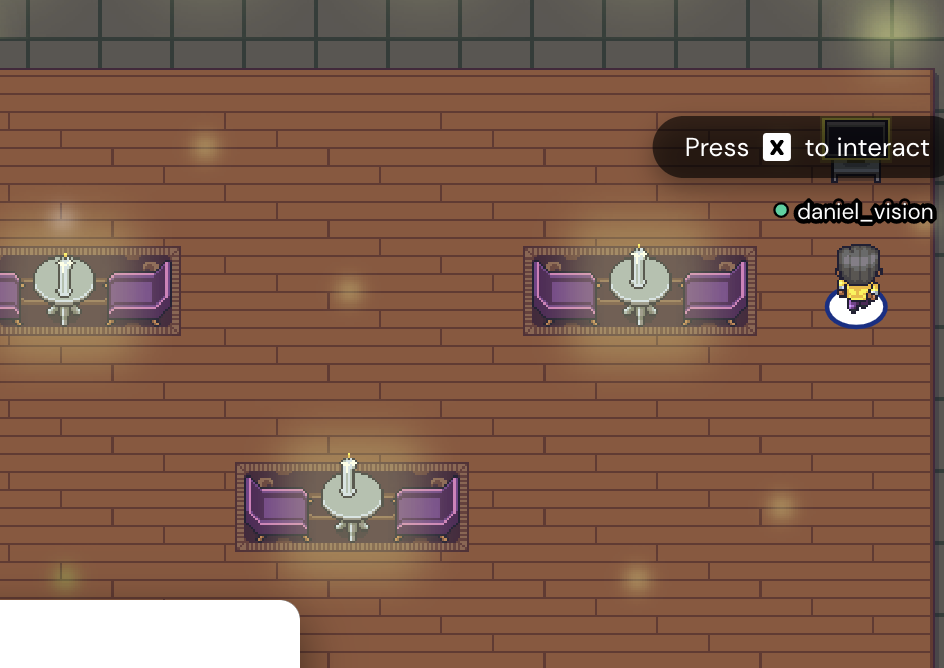
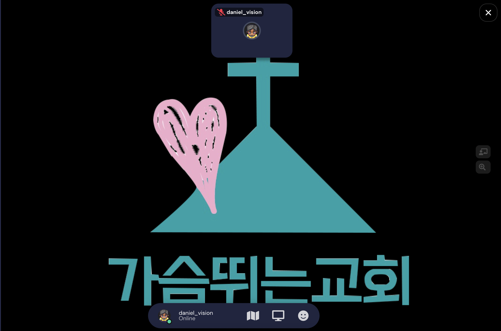
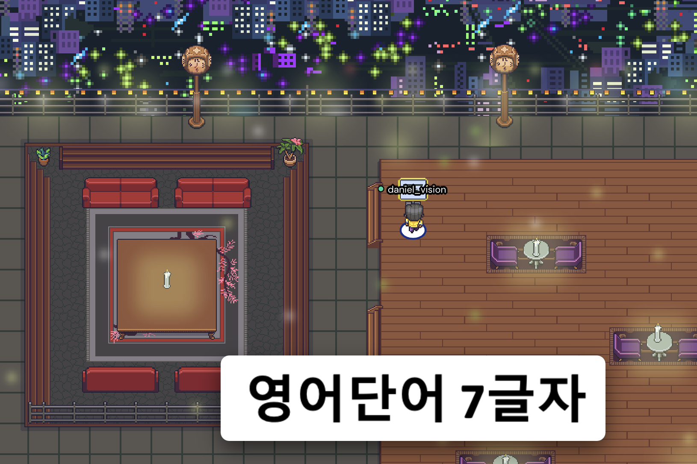
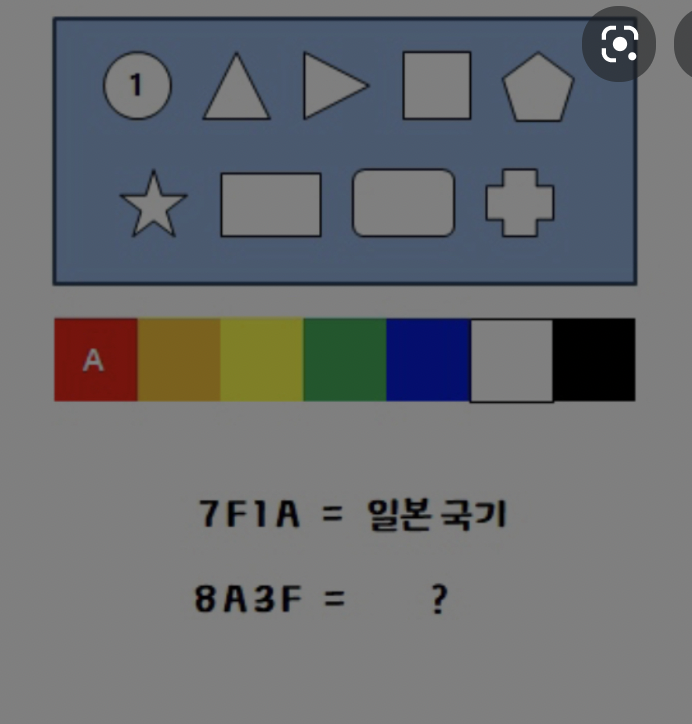
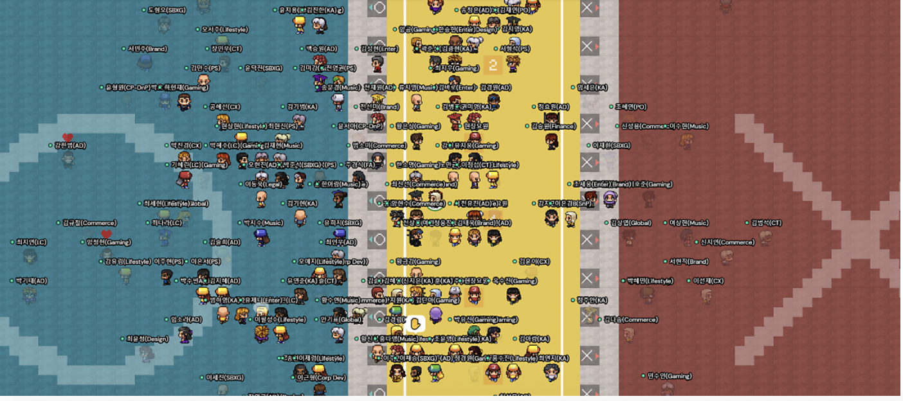
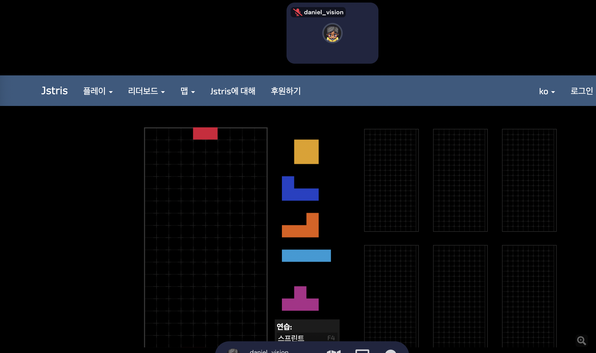

게더타운 

1. 사용조작 안내( office-main-room에서 진행)
[Gather](https://gather.town/app/TtL4H3NQvMRraYLZ/heartbeat_test_2)

	
2. 보물찾기 미션(object 숨긴걸 찾기) => 사용법 익힐겸…
	
Main room의 출입문과 연결된
루프탑, 해변가, 식당에서 보물 찾기?

상호작용 가능한 object에 보물? 이미지를 넣어두고 찾는 것은 어떨까요?

어렵게 할 필요는 없을듯 싶고, 튜트리얼 익혀보는 수준에서 
5개정도 object에 보물을 숨겨놓고 제한된 시간안에 가장 먼저 모두 찾은 목장이 승리. 

3. 방탈출 미션 안내 
	office map에서 동일한 방탈출 map을  두개 만들어서 목장별로 입장. 
		
	1.  던전 탈출느낌 [Gather](https://gather.town/app/CMWASZYAsROSCqqX/heart_beat_escape)
	기본으로 제공되는 템플릿인데요. 이걸 응용해도 될듯 싶구요.

	2. 손이 많이 갈 것 같긴 하지만,  방을 5개 정도 만들어서 object(게시판) 마다 방을 탈출할 수 있는 hint을 제공. hint을 가지고 목장원들과 논의 후에 방 탈출 코드를 사회자 카톡으로 전송.
	
	   코드가 맞다면 사회자는 map maker로 방 탈출 할 수 있는 portal를 열어주는 방식으로 진행해볼 수 있을 것 같습니다.
최종적으로 다시 office map으로 돌아올 수 있도록….
Ex)

게시판에 들어가면, 

방 탈출 힌트 출처
[찰리 방탈출 13번 힌트](https://enjoyrightnow.tistory.com/91)

4.  방을 3개 정도 연결해서 각 방마다 목장 대항 게임 진행
	
	두 목장이 같은 공간에서 진행.

	1번방 o, x 퀴즈, 사회자가 퀴즈를 이미지로 업로드하면
목장별로 대화할 수 있는공간에서 o,x를 정해서 퀴즈를 맞춤.
(방을 새롭게 만들 필요가 있음)

	2번방  
		목장 대항 테트리스, object로 제공이 됩니다.	

	3번방
		이구동성 게임
		인원만 되면 이것도 재미있을것 같네요.

5. 목장별 나눔 진행 후 끝
Main room 에 돌아와서 목장별 피드백 진행
		

